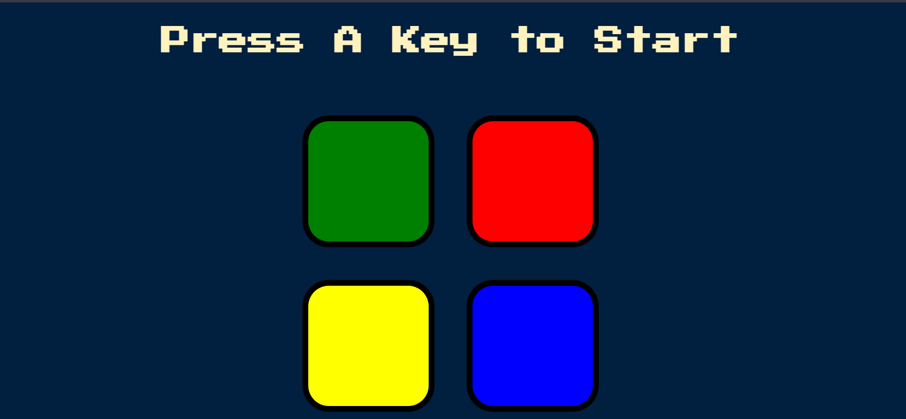

# Saimon Game

Welcome to Saimon Game! This simple memory game challenges you to remember and repeat sequences of colors. Test your memory skills and see how far you can go!



## Features
- Randomly generated color sequences.
- Progressive difficulty as the game advances.
- User-friendly interface.
- Responsive design for various devices.
- Immersive experience with sound effects.

## Installation
1. Clone this repository to your local machine:
   ```bash
   git clone https://github.com/Arunnn26/saimon-game.git
   ```

2. Open the project directory
    ```bash
    cd Saimon Game
    ```

3. Open main `index.html` file

## Description

Welcome to the Saimon Game, where classic gameplay meets modern design and technology. Here are some key highlights about the project:

- **Built with Web Technologies:** The entire project is meticulously crafted using a combination of HTML, CSS, and JavaScript, ensuring a robust and engaging gaming experience. 

- **Keyboard Interactive Interface:** Immerse yourself in the gameplay with a keyboard interactive interface. Use your keyboard for a seamless and intuitive gaming experience, enhancing your control over the game.

- **Enhanced Gaming Experience:** Elevate your gaming experience with carefully curated sound effects. Each color in the sequence is accompanied by a unique sound, adding an auditory dimension to the challenge. Turn up the volume and enjoy the rhythmic harmony of colors and sounds.

- **Modern Twist on a Classic Challenge:** While rooted in the classic Saimon Game challenge, this project introduces a modern twist. The combination of interactive features, responsive design, and engaging sound effects brings a fresh and contemporary feel to the timeless memory game.

Embark on a journey of colors, sounds, and memory. Explore the intricacies of the Saimon Game, where tradition meets innovation.
